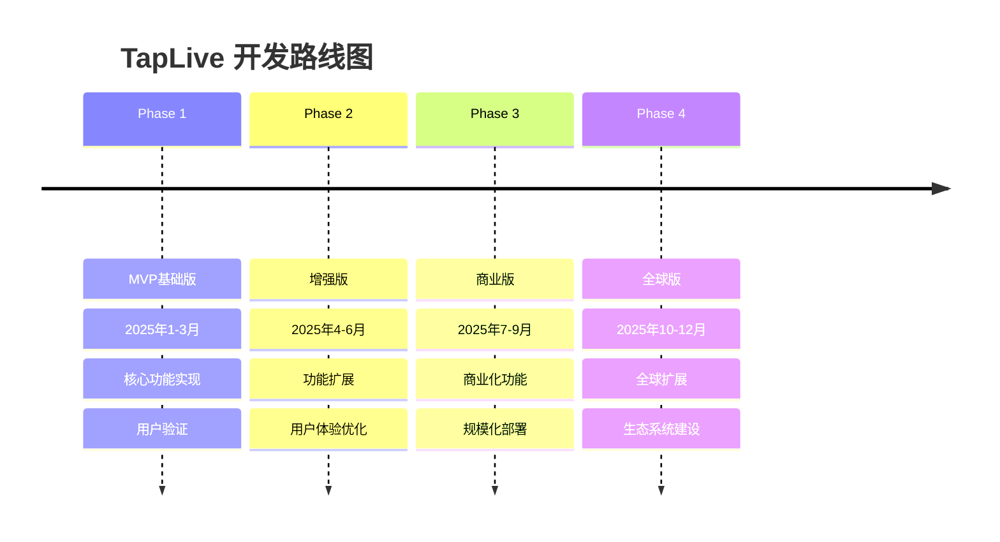
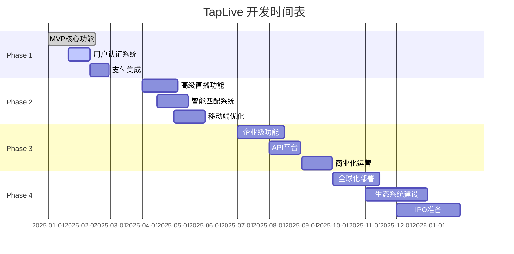

# TapLive 开发路线图

## 🎯 项目阶段概览

TapLive采用敏捷开发方法，分为四个主要阶段，每个阶段都有明确的目标、交付物和成功指标。

### 开发阶段划分



## 📅 Phase 1: MVP基础版 (2025年1-3月)

### 🎯 阶段目标
构建可用的最小化产品，验证核心商业逻辑和技术可行性。

### ✅ 已完成功能

#### 核心平台功能
- ✅ **订单管理系统** - 创建、查看、管理直播订单
- ✅ **地理位置集成** - 基于地理位置的订单匹配
- ✅ **实时WebRTC直播** - 原生浏览器直播功能
- ✅ **响应式UI设计** - 移动端和桌面端适配
- ✅ **多语言支持** - 5种语言国际化（英中日韩西）

#### 技术基础设施
- ✅ **现代前端架构** - React 18 + TypeScript + shadcn/ui
- ✅ **可扩展后端** - Node.js + Express + PostgreSQL
- ✅ **实时通信** - WebSocket + WebRTC集成
- ✅ **数据库设计** - Drizzle ORM + 完整数据模型
- ✅ **开发环境** - Vite开发服务器 + 热重载

#### 用户界面功能
- ✅ **订单创建流程** - 直观的订单创建表单
- ✅ **直播观看界面** - 多种观看模式和控制
- ✅ **订单删除功能** - 内容管理和审核机制
- ✅ **移动端导航** - 底部导航栏和响应式布局
- ✅ **状态管理** - WebRTC连接状态显示和调试

### 🚧 第一阶段剩余工作 (1-2周)

#### 高优先级
1. **用户认证系统**
   - 用户注册/登录功能
   - JWT令牌管理
   - 权限控制中间件
   - 用户信息管理页面

2. **支付集成基础**
   - Stripe支付集成
   - 基础订单支付流程
   - 支付状态管理
   - 收据和记录

3. **内容安全机制**
   - 基础内容审核
   - 违规内容报告
   - 用户封禁机制
   - 安全政策实施

#### 中优先级
1. **用户评价系统**
   - 订单完成后评价
   - 用户信誉积分
   - 评价展示界面

2. **通知系统**
   - 实时消息推送
   - 订单状态更新通知
   - 系统消息管理

### 📊 第一阶段成功指标
- **技术指标**：系统稳定性 > 95%，页面加载时间 < 2秒
- **功能指标**：所有核心功能正常运行，支持10+并发用户
- **用户指标**：完成用户旅程测试，收集初始用户反馈

## 🚀 Phase 2: 增强版 (2025年4-6月)

### 🎯 阶段目标
优化用户体验，扩展核心功能，建立初始用户社区。

### 🛠️ 核心开发任务

#### 1. 高级直播功能 (4-5周)
```typescript
// 高级WebRTC功能
- 多人直播间支持
- 屏幕共享功能
- 直播录制和回放
- 直播质量自适应
- 观众互动功能（弹幕、点赞）
```

#### 2. 智能匹配系统 (3-4周)
```typescript
// AI驱动的订单匹配
interface MatchingEngine {
  calculateDistance(order: Order, provider: User): number
  evaluateSkillMatch(order: Order, provider: User): number
  calculatePriceScore(order: Order, provider: User): number
  generateRecommendations(order: Order): User[]
}
```

#### 3. 高级用户管理 (2-3周)
- 用户等级和认证系统
- 专业技能标签和认证
- 用户作品集和历史记录
- 高级筛选和搜索功能

#### 4. 支付和财务系统 (3-4周)
- 完整的支付流程
- 多种支付方式支持
- 自动分账系统（80%给提供者，20%平台费）
- 收入报表和税务支持
- 退款和争议处理

#### 5. 移动应用优化 (2-3周)
- PWA (Progressive Web App) 支持
- 原生移动端手势
- 摄像头和麦克风高级控制
- GPS和定位服务优化

### 📱 移动端专项优化

#### PWA功能实现
```json
{
  "name": "TapLive",
  "short_name": "TapLive", 
  "description": "Global Live Streaming Marketplace",
  "start_url": "/",
  "display": "standalone",
  "background_color": "#ffffff",
  "theme_color": "#000000",
  "icons": [
    {
      "src": "/icon-192.png",
      "sizes": "192x192",
      "type": "image/png"
    }
  ]
}
```

#### 移动端性能优化
- 图片懒加载和压缩
- 关键CSS内联
- Service Worker缓存策略
- 网络状态感知

### 🤖 人工智能集成

#### 智能推荐算法
```python
# 推荐系统伪代码
def recommend_providers(order):
    candidates = get_nearby_providers(order.location, radius=50km)
    scores = []
    
    for provider in candidates:
        score = (
            distance_score(order, provider) * 0.3 +
            skill_match_score(order, provider) * 0.4 +
            rating_score(provider) * 0.2 +
            availability_score(provider) * 0.1
        )
        scores.append((provider, score))
    
    return sorted(scores, key=lambda x: x[1], reverse=True)[:5]
```

#### 内容审核AI
- 图像内容识别
- 文本敏感词检测
- 行为模式分析
- 自动风险评级

### 📊 第二阶段成功指标
- **用户指标**：注册用户 > 1000，月活跃用户 > 200
- **订单指标**：每月完成订单 > 50，平均订单价值 > $25
- **技术指标**：支持100+并发用户，直播延迟 < 500ms
- **收入指标**：月收入 > $1000（验证商业模式）

## 💼 Phase 3: 商业版 (2025年7-9月)

### 🎯 阶段目标
实现商业化运营，建立可持续的盈利模式，准备规模化扩张。

### 🏢 企业级功能开发

#### 1. 高级订单管理 (4-5周)
```typescript
// 企业订单功能
interface EnterpriseOrder {
  batchOrders: Order[]          // 批量订单
  scheduledOrders: Order[]      // 定时订单
  recurringOrders: Order[]      // 循环订单
  teamCollaboration: Team[]     // 团队协作
  advancedReporting: Report[]   // 高级报表
}
```

#### 2. 专业直播工具 (3-4周)
- 专业直播设备支持（RTMP推流）
- 多机位直播
- 绿幕和特效支持
- 直播数据分析和统计
- 自定义直播间布局

#### 3. 商业智能系统 (3-4周)
```typescript
// 数据分析仪表板
interface Analytics {
  orderTrends: TrendData[]      // 订单趋势
  userBehavior: BehaviorData[]  // 用户行为
  revenueAnalysis: RevenueData[] // 收入分析
  marketInsights: MarketData[]  // 市场洞察
  performanceMetrics: KPI[]     // 关键指标
}
```

#### 4. 高级支付系统 (2-3周)
- 企业批量支付
- 国际支付支持
- 加密货币支付选项
- 自动税务处理
- 发票和财务集成

#### 5. API和集成平台 (3-4周)
```typescript
// 开放API平台
const TapLiveAPI = {
  // 订单管理API
  orders: {
    create: (order: OrderRequest) => Promise<Order>,
    list: (filters: OrderFilters) => Promise<Order[]>,
    update: (id: string, updates: OrderUpdates) => Promise<Order>
  },
  
  // 直播API
  streaming: {
    start: (config: StreamConfig) => Promise<StreamSession>,
    stop: (sessionId: string) => Promise<void>,
    getStats: (sessionId: string) => Promise<StreamStats>
  },
  
  // 用户API
  users: {
    profile: (userId: string) => Promise<UserProfile>,
    ratings: (userId: string) => Promise<Rating[]>
  }
}
```

### 🔒 企业安全和合规

#### 数据保护和隐私
```typescript
// GDPR合规性
const privacyControls = {
  dataRetention: '用户数据保留政策',
  rightToForgotten: '被遗忘权实现',
  dataPortability: '数据导出功能',
  consentManagement: '同意管理系统'
}
```

#### 企业级安全
- 单点登录（SSO）集成
- 多因素认证（MFA）
- 企业防火墙支持
- 数据加密和备份
- 安全审计日志

### 💰 商业化功能

#### 1. 订阅和会员系统
```typescript
// 会员等级
enum MembershipTier {
  FREE = 'free',        // 免费版：基础功能
  PRO = 'pro',          // 专业版：高级功能
  BUSINESS = 'business', // 商业版：企业功能
  ENTERPRISE = 'enterprise' // 企业版：定制服务
}
```

#### 2. 广告和营销平台
- 地理位置定向广告
- 用户行为定向
- 赞助内容推广
- 营销活动管理

#### 3. 数据服务产品
- 市场趋势报告
- 用户行为分析
- 地理位置洞察
- 竞品分析报告

### 📊 第三阶段成功指标
- **商业指标**：月收入 > $10,000，付费转化率 > 5%
- **用户指标**：注册用户 > 10,000，企业客户 > 50
- **技术指标**：支持1000+并发用户，99.9%可用性
- **市场指标**：在3个主要城市建立用户社区

## 🌍 Phase 4: 全球版 (2025年10-12月)

### 🎯 阶段目标
实现全球化扩张，建立完整的生态系统，成为行业领导者。

### 🌐 全球化基础设施

#### 1. 多区域部署 (4-5周)
```yaml
# 全球部署架构
regions:
  - name: us-east-1
    primary: true
    services: [api, database, cdn]
  - name: eu-west-1  
    services: [api, database-replica, cdn]
  - name: ap-southeast-1
    services: [api, database-replica, cdn]
```

#### 2. 本地化适配 (3-4周)
- 20+语言本地化
- 本地支付方式支持
- 本地法律法规合规
- 本地客服和支持

#### 3. CDN和性能优化 (2-3周)
- 全球CDN网络部署
- 智能路由和负载均衡
- 边缘计算和缓存
- 网络延迟优化

### 🤝 生态系统建设

#### 1. 合作伙伴平台 (3-4周)
```typescript
// 合作伙伴API
interface PartnerAPI {
  deviceIntegration: {
    cameras: CameraDevice[]
    drones: DroneDevice[]  
    iot: IoTDevice[]
  }
  
  platformIntegration: {
    socialMedia: SocialPlatform[]
    ecommerce: EcommercePlatform[]
    cms: CMSPlatform[]
  }
}
```

#### 2. 开发者生态 (2-3周)
- SDK和开发工具包
- 开发者文档和教程
- 开发者社区和论坛
- 开发者激励计划

#### 3. 第三方集成 (3-4周)
- 社交媒体平台集成
- 电商平台集成
- 支付服务商集成
- 云服务提供商集成

### 🚀 高级功能

#### 1. AI和机器学习 (4-5周)
```python
# 高级AI功能
class TapLiveAI:
    def predictDemand(self, location, time, weather):
        """预测特定时间地点的服务需求"""
        pass
        
    def optimizeScheduling(self, orders, providers):
        """优化订单分配和调度"""
        pass
        
    def detectAnomalies(self, userBehavior, orderPatterns):
        """检测异常行为和欺诈"""
        pass
```

#### 2. 区块链集成 (3-4周)
- 去中心化身份验证
- 智能合约支付
- 代币激励机制
- 去中心化治理

#### 3. AR/VR支持 (2-3周)
- WebXR直播支持
- 虚拟现实观看体验
- 增强现实订单展示

### 📈 商业拓展

#### 1. 企业解决方案
- 白标解决方案
- 私有化部署
- 定制开发服务
- 咨询和培训服务

#### 2. 垂直行业拓展
- 房地产看房直播
- 旅游景点直播
- 教育培训直播
- 医疗远程诊断

#### 3. B2B2C模式
- 企业客户平台化
- 合作伙伴分销网络
- 行业解决方案套件

### 📊 第四阶段成功指标
- **全球指标**：覆盖20+国家，支持50+语言
- **商业指标**：年收入 > $1,000,000，企业客户 > 500
- **用户指标**：全球注册用户 > 100,000，月活跃用户 > 20,000
- **技术指标**：全球平均延迟 < 100ms，支持10,000+并发

## 🛠️ 开发流程和方法论

### 敏捷开发流程

#### Sprint规划
```
Sprint周期: 2周
每日站会: 15分钟进度同步
Sprint评审: 演示完成功能
Sprint回顾: 改进流程和效率
```

#### 版本发布策略
```
主版本(Major): 每季度一次，包含重大功能更新
次版本(Minor): 每月一次，包含新功能和优化
补丁版本(Patch): 随时发布，修复关键问题
```

### 质量保证流程

#### 代码质量
```typescript
// 代码质量标准
const codeStandards = {
  testCoverage: '>= 80%',
  linting: 'ESLint + Prettier',
  typeChecking: 'TypeScript strict mode',
  codeReview: '所有PR必须review'
}
```

#### 测试策略
```
单元测试: 覆盖所有核心业务逻辑
集成测试: 覆盖API和数据库交互
端到端测试: 覆盖关键用户路径
性能测试: 负载测试和压力测试
```

### 风险管理

#### 技术风险
- **WebRTC兼容性**：多浏览器测试，后备方案
- **实时性能**：性能监控，自动扩缩容
- **数据安全**：加密传输，定期安全审计

#### 商业风险  
- **市场竞争**：差异化定位，快速迭代
- **法律合规**：各国法律咨询，合规检查
- **资金需求**：融资规划，现金流管理

#### 运营风险
- **团队扩张**：人才招聘，文化建设
- **用户增长**：用户获取，留存优化
- **服务质量**：监控体系，应急响应

## 📅 关键里程碑时间表



## 💡 创新和研发方向

### 技术创新研究
1. **6G网络适配**：为下一代网络做技术储备
2. **量子加密**：探索量子安全通信方案
3. **脑机接口**：研究思维控制的直播交互
4. **全息投影**：3D实时投影技术集成

### 商业模式创新
1. **DAO治理**：去中心化自治组织模式
2. **碳中和服务**：绿色环保的直播解决方案
3. **元宇宙集成**：虚拟世界的直播服务
4. **AI数字人**：虚拟主播和AI助手服务

---

**这个开发路线图为TapLive项目提供了清晰的发展路径，从MVP验证到全球化扩张，每个阶段都有明确的目标和可衡量的成功指标。通过科学的项目管理和敏捷开发方法，确保项目能够按时交付并持续改进。**