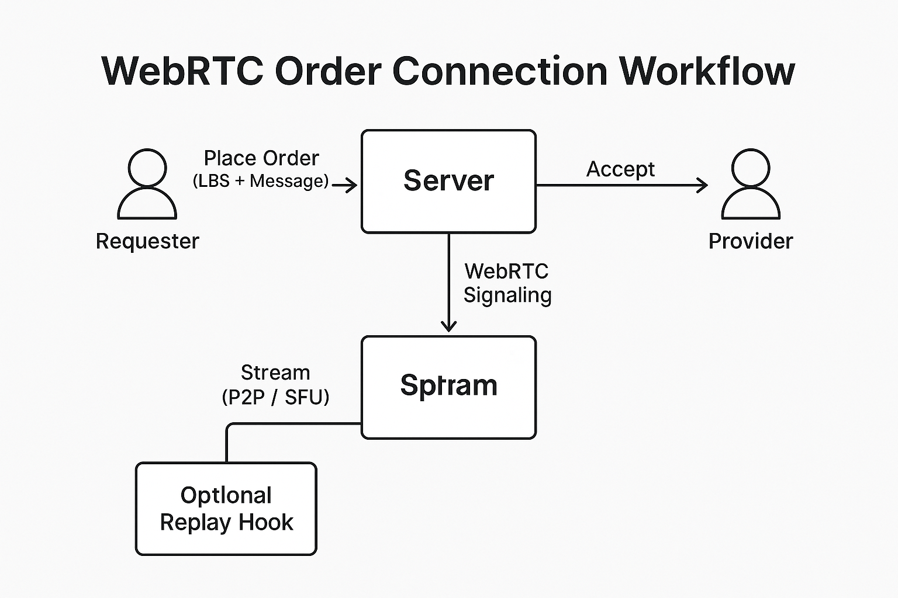

# What are we building?

For this hackathon, we aim to focus on one or more of the following modules:

- ✅ Real-time order acceptance/grabbing system prototype
- ✅ Video on demand & payment interface process
- ✅ Geolocation verification & anti-counterfeiting live streaming SDK
- ✅ Video acceleration technology, CDN acceleration optimization technology (optional)
- ✅ Content access control and playback record scoring mechanism (optional)
- ✅ Group order model (AA ordering) (optional)
- ✅ Decentralized cache node access (PCDN) (optional)

## 🔄 Workflow Diagram
The diagram below illustrates the MVP system flow from **order placement**, **WebRTC connection**, **real-time livestreaming**, to **optional replay hook**.

# Roadmap: Phase 1 & Phase 2

## Phase 1
- MVP launch: Live Dispatch Orders & Real-Time Interaction
- Geo-matching engine integration
- Risk Control Mechanism setup

Phase 2  
- Trust Layer Development  
- Feedback & Iteration Cycle  
- Community and Developer Participation/Recruitment/Expansion
