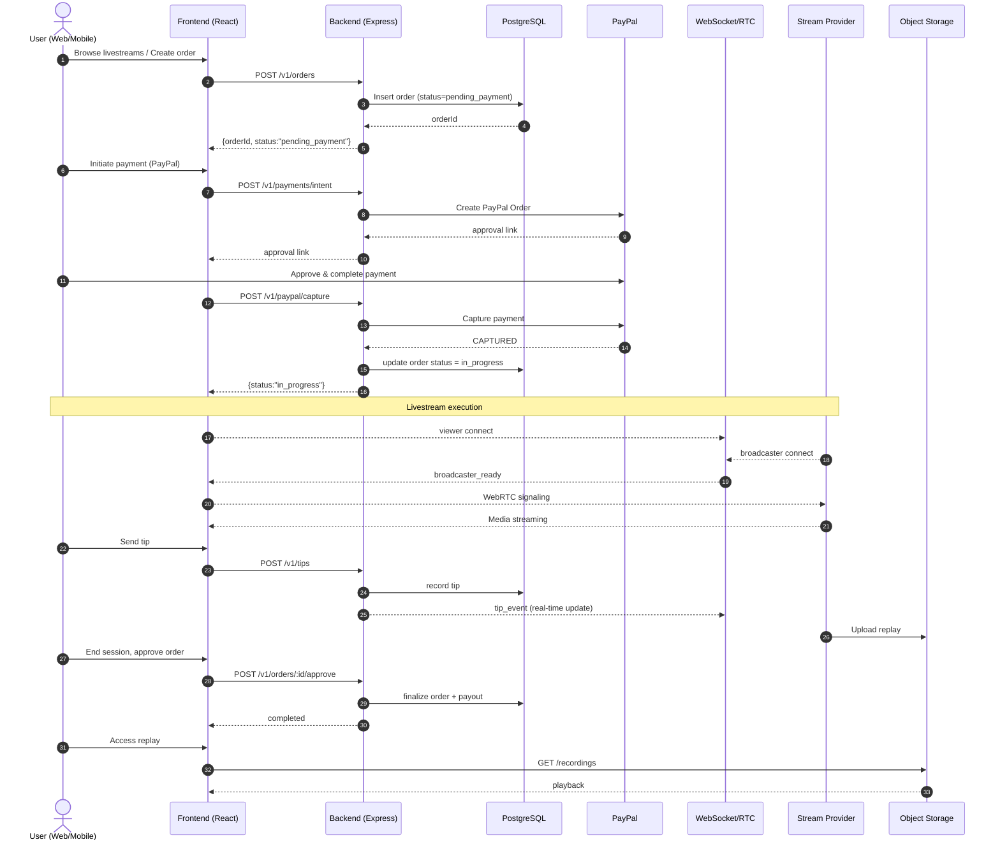
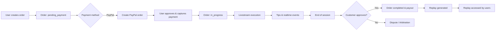
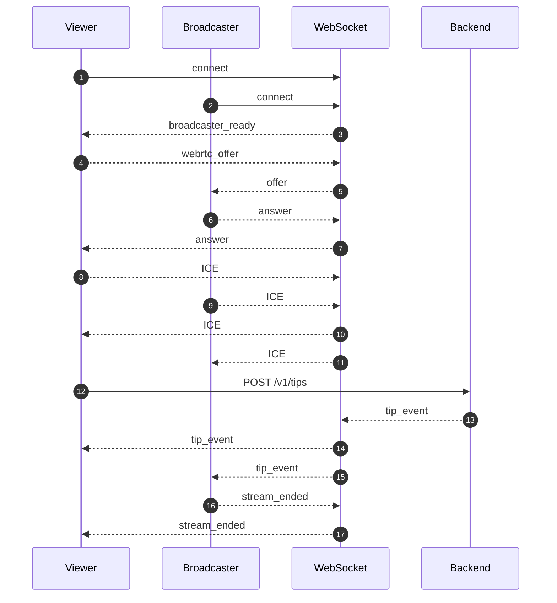
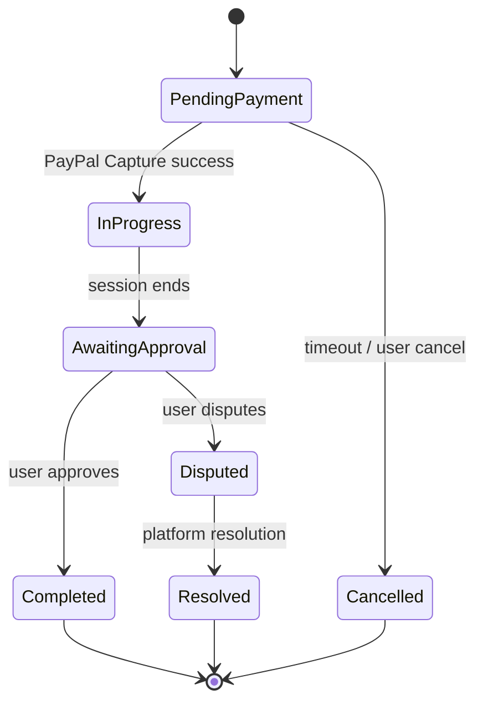
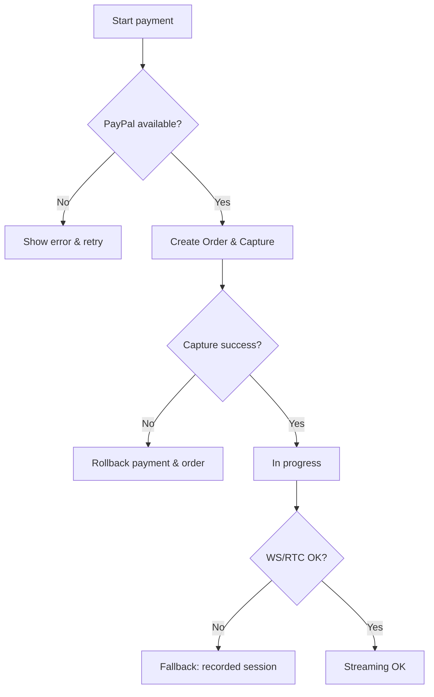
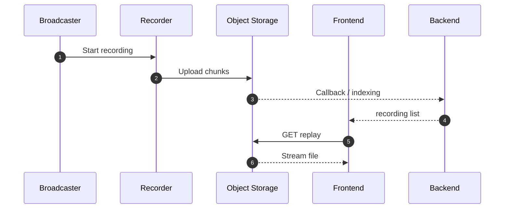

> **Purpose:** This diagram illustrates the complete flow of TapLive during the MVP phase — from user interaction to order creation, payment, livestream execution, and replay access.  
> It helps reviewers understand the project at a glance.

## 1. High-Level Sequence Diagram (User → Order → Streaming → Replay)

## 2. Business Flow (Order → Payment → Execution → Settlement)

## 3. Realtime WebSocket / Signaling Flow

## 4. Payment & Order State Machine

## 5. Failure & Recovery Path

## 6. Data Objects (Minimal Fields)
- **Order**  
  - `id`, `title`, `startAt`, `durationMin`, `amount {currency, value}`, `status`
- **Payment**  
  - `id`, `orderId`, `method`, `status`, `externalId`, `capturedAt`
- **Tip**  
  - `id`, `streamId`, `userId`, `amount {currency, value}`, `confirmed`, `timestamp`
- **Webhook Log**  
  - `id`, `source`, `eventType`, `payloadHash`, `status`, `retries`

## 7. Replay Flow (Optional)

## 8. Legend
- 🟦 Frontend / Backend / Third-party services (PayPal, storage)  
- 🟩 Key states (pending_payment → in_progress → completed)  
- 🟧 Error or dispute branches  
- 🟪 Optional components (e.g., recording)

## 9. API Reference Mapping
- `POST /v1/orders` → Order creation  
- `POST /v1/payments/intent` → Payment initiation  
- `POST /v1/paypal/create-order` / `capture` → Payment flow  
- `WS /v1/ws` → Livestream signaling  
- `POST /v1/tips` → Tip  
- `POST /v1/orders/:id/approve` → Completion & payout  
- Replay (optional) → Object storage URL

📎 See also: `09_api-draft.md`

✅ Usage:  
- Save this file as `docs/10_workflow-diagram.md`  
- GitHub will render the Mermaid diagrams automatically.  
- Suitable for ETHGlobal Hackathon submission.
