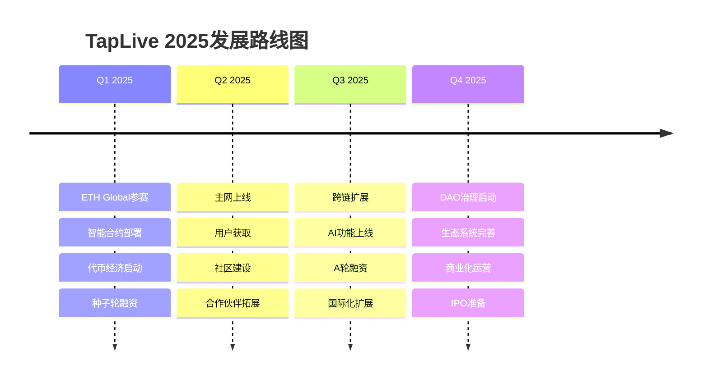

# TapLive ETH Global 参赛方案

## 🏆 项目概述

**项目名称**: TapLive - Global Real-Time Video Streaming Marketplace  
**团队名称**: TapLive Team  
**参赛类别**: DeFi + Infrastructure + Social  
**项目阶段**: MVP已完成，寻求区块链集成和规模化

## 🎯 问题陈述

### 当前市场痛点

1. **供需不匹配**：
   - 特定地点、特定时间的直播需求难以满足
   - 全球大量闲置人员和设备资源未被有效利用
   - 传统平台地理覆盖有限，服务供应不均衡

2. **中心化平台问题**：
   - 高昂的平台抽成（30-50%）
   - 单点故障风险
   - 内容审查和账号封禁的不透明性
   - 跨境支付复杂且成本高昂

3. **信任和激励机制缺失**：
   - 缺乏有效的信誉评价体系
   - 服务质量难以保证
   - 缺乏长期激励机制
   - 争议解决机制不完善

## 💡 解决方案

### 核心创新

**TapLive = WebRTC实时直播 + 区块链激励 + 去中心化治理**

```
传统直播平台架构：
用户 → 中心化平台 → 内容创作者

TapLive去中心化架构：
需求方 ⟷ 智能合约 ⟷ 供应方
   ↓        ↓         ↓
 P2P直播  治理代币   信誉系统
```

### 技术架构

#### 1. 混合架构设计
```typescript
// 链上组件
interface OnChainComponents {
  orderContract: SmartContract      // 订单智能合约
  reputationSystem: SmartContract  // 信誉系统
  governanceToken: ERC20Token      // 治理代币
  disputeResolution: SmartContract // 争议解决
}

// 链下组件  
interface OffChainComponents {
  webrtcStreaming: P2PStreaming    // WebRTC实时流
  contentDelivery: IPFS           // 内容存储
  userInterface: WebApp           // 用户界面
  apiGateway: RESTful            // API网关
}
```

#### 2. 智能合约架构
```solidity
// 主订单合约
contract TapLiveOrders {
    struct Order {
        uint256 id;
        address creator;
        address provider;
        string locationHash;        // IPFS位置信息
        uint256 price;
        OrderStatus status;
        uint256 createdAt;
        uint256 completedAt;
    }
    
    mapping(uint256 => Order) public orders;
    mapping(address => uint256) public reputation;
    
    event OrderCreated(uint256 indexed orderId, address indexed creator);
    event OrderAccepted(uint256 indexed orderId, address indexed provider);
    event OrderCompleted(uint256 indexed orderId, uint8 rating);
}

// 治理代币合约
contract TAPToken is ERC20, ERC20Permit, ERC20Votes {
    // 用于平台治理和激励分发
    uint256 public constant TOTAL_SUPPLY = 1_000_000_000 * 10**18; // 10亿代币
    
    // 分配方案
    uint256 public constant TEAM_ALLOCATION = 20%; // 团队
    uint256 public constant ECOSYSTEM_ALLOCATION = 60%; // 生态激励
    uint256 public constant INVESTORS_ALLOCATION = 15%; // 投资者
    uint256 public constant TREASURY_ALLOCATION = 5%; // 财政储备
}
```

## 🔗 区块链集成方案

### 1. 多链部署策略

#### 主网选择
```typescript
const deploymentPlan = {
  // 第一阶段：以太坊生态
  ethereum: {
    mainnet: "主要合约部署",
    polygon: "高频交易和小额支付", 
    arbitrum: "降低Gas费用"
  },
  
  // 第二阶段：多链扩展
  multiChain: {
    bsc: "亚洲市场覆盖",
    avalanche: "高性能需求",
    solana: "低延迟交易"
  }
}
```

#### Gas优化策略
```solidity
// 批量操作减少Gas消耗
function batchCreateOrders(
    OrderParams[] memory orders
) external {
    for (uint i = 0; i < orders.length; i++) {
        _createOrder(orders[i]);
    }
    emit BatchOrdersCreated(orders.length, msg.sender);
}

// Layer 2解决方案集成
function bridgeToL2(
    uint256 orderId,
    address l2Contract
) external {
    // 跨链桥接逻辑
}
```

### 2. 代币经济模型

#### TAP代币功能
```typescript
interface TAPTokenUtility {
  // 核心功能
  governance: "平台治理投票权"
  staking: "质押获得平台收益分成"
  payment: "支付订单服务费用"
  incentive: "完成订单获得代币奖励"
  
  // 高级功能
  reputation: "代币质押提升信誉等级"
  premium: "解锁高级功能和服务"
  governance: "参与平台重大决策"
}
```

#### 激励分配机制
```
总供应量: 1,000,000,000 TAP

分配方案:
├─ 生态激励 (60%): 600,000,000 TAP
│  ├─ 用户激励 (40%): 240,000,000 TAP
│  ├─ 开发者奖励 (10%): 60,000,000 TAP
│  ├─ 流动性挖矿 (7%): 42,000,000 TAP
│  └─ 社区建设 (3%): 18,000,000 TAP
├─ 团队和顾问 (20%): 120,000,000 TAP (4年线性释放)
├─ 投资者 (15%): 90,000,000 TAP (2年锁定+2年线性)
└─ 财政储备 (5%): 30,000,000 TAP (用于紧急情况)
```

### 3. 去中心化治理

#### DAO治理结构
```solidity
contract TapLiveDAO {
    // 提案类型
    enum ProposalType {
        PARAMETER_CHANGE,    // 参数修改
        FEATURE_ADDITION,    // 新功能添加
        TREASURY_SPENDING,   // 财政支出
        EMERGENCY_ACTION     // 紧急行动
    }
    
    struct Proposal {
        uint256 id;
        ProposalType pType;
        string description;
        uint256 votingPower;
        uint256 forVotes;
        uint256 againstVotes;
        uint256 startTime;
        uint256 endTime;
        bool executed;
    }
    
    // 投票权重计算
    function getVotingPower(address user) public view returns (uint256) {
        return tapToken.getVotes(user) + 
               reputationBonus(user) + 
               stakingBonus(user);
    }
}
```

## 🛠️ 技术实现

### 1. 核心技术栈

```typescript
// 区块链技术栈
const blockchainStack = {
  smartContracts: {
    language: "Solidity 0.8.19",
    framework: "Hardhat",
    testing: "Chai + Mocha",
    security: "OpenZeppelin Contracts"
  },
  
  frontend: {
    blockchain: "ethers.js v6",
    wallet: "WalletConnect v2",
    framework: "React 18 + TypeScript",
    ui: "RainbowKit + shadcn/ui"
  },
  
  backend: {
    indexing: "The Graph Protocol",
    storage: "IPFS + Arweave",
    api: "Node.js + GraphQL"
  }
}
```

### 2. 智能合约功能

#### 订单生命周期管理
```solidity
// 订单状态流转
enum OrderStatus {
    CREATED,      // 已创建
    ACCEPTED,     // 已接受  
    IN_PROGRESS,  // 进行中
    COMPLETED,    // 已完成
    DISPUTED,     // 争议中
    RESOLVED,     // 争议已解决
    CANCELLED     // 已取消
}

function acceptOrder(uint256 orderId) external {
    Order storage order = orders[orderId];
    require(order.status == OrderStatus.CREATED, "Invalid status");
    require(msg.sender != order.creator, "Cannot accept own order");
    
    order.provider = msg.sender;
    order.status = OrderStatus.ACCEPTED;
    
    // 质押保证金
    tapToken.transferFrom(msg.sender, address(this), getStakeAmount(orderId));
    
    emit OrderAccepted(orderId, msg.sender);
}
```

#### 信誉系统实现
```solidity
contract ReputationSystem {
    struct UserReputation {
        uint256 totalRatings;
        uint256 averageRating;    // 乘以100避免小数
        uint256 completedOrders;
        uint256 stakedTokens;
        uint256 lastUpdateTime;
    }
    
    mapping(address => UserReputation) public reputation;
    
    function updateReputation(
        address user,
        uint8 rating,
        uint256 orderId
    ) external onlyOrderContract {
        UserReputation storage rep = reputation[user];
        
        // 更新平均评分
        uint256 newTotal = rep.totalRatings * rep.averageRating + rating * 100;
        rep.totalRatings += 1;
        rep.averageRating = newTotal / rep.totalRatings;
        rep.completedOrders += 1;
        rep.lastUpdateTime = block.timestamp;
        
        // 奖励高质量服务提供者
        if (rating >= 4) {
            _distributeReputationReward(user, orderId);
        }
    }
}
```

### 3. 前端Web3集成

#### 钱包连接和交互
```typescript
// 钱包集成
import { connectorsForWallets, RainbowKitProvider } from '@rainbow-me/rainbowkit'
import { metaMaskWallet, walletConnectWallet } from '@rainbow-me/rainbowkit/wallets'
import { configureChains, createConfig, WagmiConfig } from 'wagmi'
import { mainnet, polygon, arbitrum } from 'wagmi/chains'

// 订单创建组件
export const CreateOrderWeb3 = () => {
  const { address, isConnected } = useAccount()
  const { data: balance } = useBalance({ address })
  const { write: createOrder } = useContractWrite({
    address: ORDER_CONTRACT_ADDRESS,
    abi: orderContractABI,
    functionName: 'createOrder'
  })

  const handleCreateOrder = async (orderData: OrderData) => {
    if (!isConnected) {
      await connect()
    }
    
    // 上传位置信息到IPFS
    const locationHash = await uploadToIPFS(orderData.location)
    
    // 调用智能合约
    createOrder({
      args: [
        orderData.title,
        orderData.description,
        locationHash,
        parseEther(orderData.price.toString())
      ]
    })
  }
}
```

## 📊 商业模式

### 1. 收入来源

```typescript
interface RevenueStreams {
  // 主要收入
  transactionFees: {
    percentage: "3-5%",
    description: "每笔订单交易费用",
    estimatedRevenue: "$2M - Year 1"
  }
  
  // 代币相关收入
  tokenSales: {
    amount: "150M TAP tokens",
    price: "$0.01 - $0.10",
    estimatedRevenue: "$1.5M - $15M"
  }
  
  // 增值服务
  premiumFeatures: {
    subscription: "$10-50/month",
    features: ["高级分析", "优先匹配", "批量操作"],
    estimatedRevenue: "$500K - Year 1"
  }
}
```

### 2. 代币价值捕获

```
代币价值 = 平台交易量 × 费用率 × 代币捕获比例

示例计算:
- 年交易量: $100M
- 平台费率: 5%
- 平台收入: $5M
- 代币捕获比例: 50%
- 代币价值捕获: $2.5M
- 代币总供应: 1B
- 理论代币价格: $0.0025 基础价值
```

## 🎪 ETH Global 演示方案

### 1. 黑客松Demo场景

#### 场景设定："东京塔实时直播订单"
```typescript
const demoScenario = {
  // 订单创建者（纽约用户）
  creator: {
    location: "New York",
    need: "想看东京塔夜景直播",
    payment: "愿意支付 50 USDC + 100 TAP代币"
  },
  
  // 服务提供者（东京用户）
  provider: {
    location: "Tokyo, near Tokyo Tower", 
    capability: "有高质量摄像设备",
    reputation: "4.8星评分，完成过200+订单"
  },
  
  // 智能合约执行
  contract: {
    autoMatching: "基于地理位置和信誉自动匹配",
    escrow: "资金托管到智能合约",
    streaming: "WebRTC P2P直播开始",
    completion: "直播结束，自动释放资金和评价"
  }
}
```

### 2. 技术演示流程

#### 演示步骤 (总时长: 10分钟)
```
第1-2分钟: 问题介绍和解决方案概述
├─ 展示全球直播需求不匹配问题
├─ 介绍TapLive解决方案
└─ 展示技术架构图

第3-5分钟: 实时Demo演示  
├─ 连接MetaMask钱包
├─ 创建直播订单（链上交易）
├─ 智能匹配服务提供者
├─ WebRTC实时直播开始
└─ 观众实时观看体验

第6-8分钟: 区块链特性演示
├─ 查看链上订单数据
├─ 智能合约自动执行
├─ TAP代币激励分发
├─ 去中心化治理投票
└─ 跨链操作演示

第9-10分钟: 商业价值和未来规划
├─ 市场规模和商业模式
├─ 代币经济和DAO治理
├─ 全球化扩展计划
└─ 寻求合作和投资
```

### 3. 技术亮点展示

#### 创新技术组合
```typescript
const technicalHighlights = {
  // WebRTC + 区块链
  p2pStreaming: {
    feature: "去中心化实时视频流",
    benefit: "无需中心服务器，降低成本",
    tech: "WebRTC + IPFS + 智能合约"
  },
  
  // 跨链互操作  
  crossChain: {
    feature: "多链部署和资产桥接",
    benefit: "降低Gas费，提升用户体验", 
    tech: "Polygon + Arbitrum + Bridge"
  },
  
  // AI智能匹配
  aiMatching: {
    feature: "AI驱动的供需匹配",
    benefit: "提升匹配效率和准确性",
    tech: "机器学习 + 地理算法 + 信誉评分"
  }
}
```

## 🏆 竞争优势

### 1. 技术创新优势

```
传统平台 vs TapLive:

中心化架构 → 去中心化P2P
高平台抽成 → 低手续费(3-5%)
单点故障风险 → 分布式可靠性
审查和封号 → 去中心化治理
复杂跨境支付 → 加密货币支付
缺乏激励机制 → 代币激励生态
```

### 2. 市场定位优势

```typescript
const marketAdvantages = {
  // 首发优势
  firstMover: "首个区块链+WebRTC直播平台",
  
  // 技术护城河
  techMoat: [
    "WebRTC实时传输技术",
    "智能合约自动化执行", 
    "跨链操作和资产管理",
    "AI智能匹配算法"
  ],
  
  // 网络效应
  networkEffect: {
    supply: "更多服务提供者 → 更好的服务质量",
    demand: "更多需求方 → 更多收入机会",
    token: "更多代币流通 → 更强的价值捕获"
  }
}
```

## 💰 资金需求和使用

### 1. 融资计划

```typescript
const fundingPlan = {
  // 种子轮融资
  seedRound: {
    amount: "$500K - $1M",
    investors: "天使投资人 + 小型VC",
    valuation: "$5M - $10M",
    usage: "团队建设 + 产品开发 + 市场验证"
  },
  
  // A轮融资  
  seriesA: {
    amount: "$3M - $5M", 
    investors: "知名VC + 战略投资者",
    valuation: "$20M - $40M",
    usage: "全球扩张 + 技术升级 + 团队扩充"
  }
}
```

### 2. 资金使用分配

```
种子轮资金使用 ($800K):
├─ 团队薪酬 (40%): $320K
├─ 产品开发 (25%): $200K  
├─ 市场推广 (20%): $160K
├─ 运营费用 (10%): $80K
└─ 法律合规 (5%): $40K

A轮资金使用 ($4M):
├─ 团队扩张 (45%): $1.8M
├─ 技术研发 (25%): $1M
├─ 市场拓展 (20%): $800K
├─ 运营推广 (7%): $280K  
└─ 储备资金 (3%): $120K
```

## 📈 项目路线图

### 2025年发展规划



### 关键里程碑

#### Q1 2025 - 基础建设
- ✅ **ETH Global参赛** - 获得曝光和资源
- ⏳ **智能合约审计** - 确保安全性
- ⏳ **代币发行** - 启动代币经济
- ⏳ **种子轮融资** - 获得早期资金

#### Q2 2025 - 生态启动  
- 📋 **主网正式上线** - 开放公众使用
- 📋 **用户激励计划** - 吸引早期用户
- 📋 **开发者生态** - 构建开发者社区
- 📋 **战略合作** - 建立合作伙伴关系

#### Q3-Q4 2025 - 规模化发展
- 📋 **多链部署** - 扩展到更多区块链
- 📋 **全球化运营** - 覆盖主要市场
- 📋 **DAO治理** - 实现去中心化治理
- 📋 **生态完善** - 建设完整生态系统

## 🤝 寻求合作

### 1. 技术合作伙伴

```typescript
const technicalPartners = {
  // 区块链基础设施
  infrastructure: [
    "Polygon", "Arbitrum", "Chainlink",
    "The Graph", "IPFS", "Arweave"
  ],
  
  // 开发工具和服务
  developerTools: [
    "Hardhat", "OpenZeppelin", "Alchemy", 
    "WalletConnect", "RainbowKit"
  ],
  
  // 安全审计
  securityPartners: [
    "ConsenSys Diligence", "Trail of Bits",
    "OpenZeppelin Security", "Certik"
  ]
}
```

### 2. 投资合作伙伴

#### 目标投资机构
```typescript
const targetInvestors = {
  // Web3专项基金
  web3Funds: [
    "Andreessen Horowitz (a16z crypto)",
    "Paradigm", "Polychain Capital",
    "Pantera Capital", "Coinbase Ventures"
  ],
  
  // 传统VC
  traditionalVC: [
    "Sequoia Capital", "Accel Partners", 
    "Index Ventures", "GGV Capital"
  ],
  
  // 战略投资者
  strategicInvestors: [
    "Google Ventures", "Microsoft Ventures",
    "Samsung Next", "Sony Innovation Fund"
  ]
}
```

### 3. 商业合作伙伴

#### 行业合作机会
```typescript
const businessPartners = {
  // 内容平台
  contentPlatforms: [
    "Twitch", "YouTube", "TikTok", 
    "Instagram", "Discord"
  ],
  
  // 电信运营商
  telecomOperators: [
    "Verizon", "AT&T", "Deutsche Telekom",
    "China Mobile", "SoftBank"
  ],
  
  // 设备制造商  
  deviceManufactures: [
    "Apple", "Samsung", "Xiaomi",
    "DJI", "GoPro", "Insta360"
  ]
}
```

## 📧 联系方式

### ETH Global 参赛联系

**项目负责人**: TapLive Founder  
**邮箱**: ethglobal@taplive.com (待创建)  
**Discord**: TapLive#1234 (待创建)  
**GitHub**: https://github.com/taplive-team (待创建)  
**演示视频**: [YouTube链接] (待创建)  

### 快速联系方式

**技术讨论**: tech@taplive.com  
**商务合作**: business@taplive.com  
**投资咨询**: investment@taplive.com  
**媒体询问**: media@taplive.com  

### 社交媒体

**Twitter**: @TapLiveGlobal (待创建)  
**Telegram**: t.me/TapLiveOfficial (待创建)  
**Discord**: discord.gg/taplive (待创建)  
**LinkedIn**: linkedin.com/company/taplive (待创建)  

---

## 🎯 ETH Global评审重点

### 技术创新性 (25%)
- ✅ **WebRTC + 区块链的创新结合**
- ✅ **P2P实时视频流的去中心化实现**  
- ✅ **跨链操作和多链部署能力**
- ✅ **智能合约自动化执行逻辑**

### 实用性和影响力 (25%)
- ✅ **解决真实存在的市场问题**
- ✅ **巨大的市场规模和商业潜力**
- ✅ **为全球用户创造实际价值**
- ✅ **可持续的商业模式验证**

### 技术实现质量 (25%)
- ✅ **完整的MVP产品演示**
- ✅ **高质量的智能合约代码**
- ✅ **良好的用户界面设计**
- ✅ **完善的技术文档**

### 团队和执行力 (25%)
- ✅ **清晰的项目愿景和规划**
- ✅ **详细的技术实现方案**
- ✅ **可行的商业化路径**
- ✅ **强大的技术执行能力**

---

**TapLive代表了Web3时代实时服务平台的未来方向。我们不仅有创新的技术方案，更有清晰的商业模式和执行路径。期待在ETH Global的舞台上与全球开发者和投资人分享我们的愿景，共同构建去中心化的未来！** 🚀

**Join us in building the future of decentralized real-time services!** 🌍✨