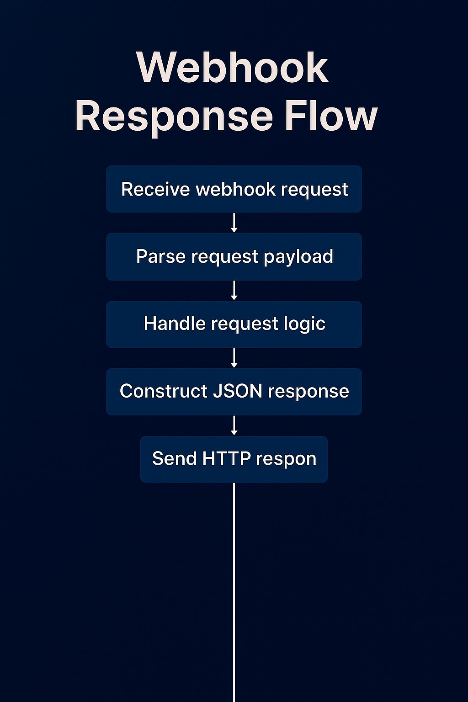
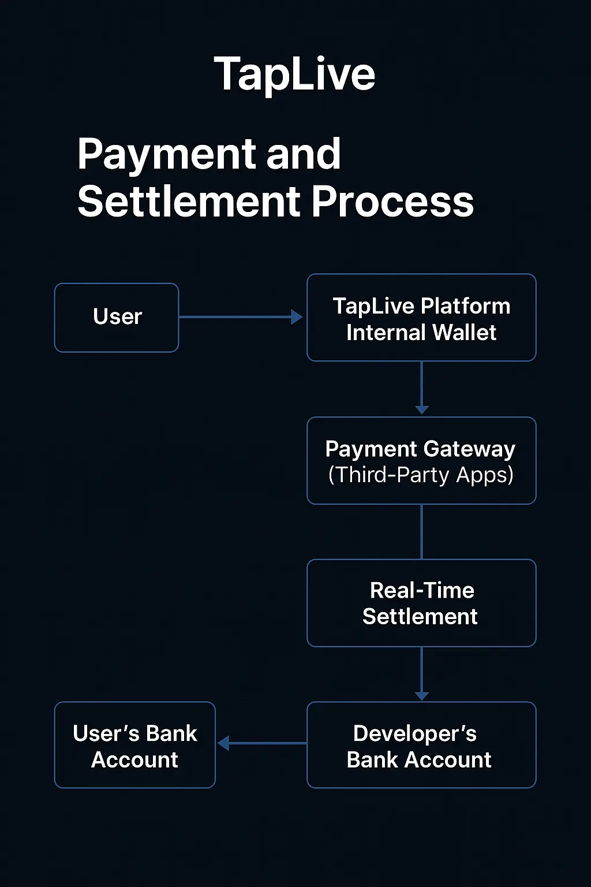
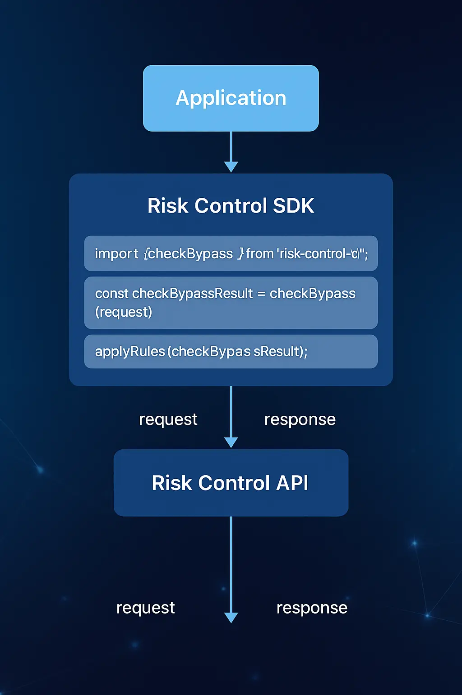

# TapLive MVP - Professional Technical Implementation Guide

## 🌟 Executive Summary

**TapLive MVP** is a revolutionary location-based real-time video streaming platform that connects global users with immediate action services in the physical world. This comprehensive technical guide provides enterprise-grade implementation specifications for Phase 1-2 MVP development, designed for international developer teams and hackathon participation.

## 🏗️ Technical Architecture Overview

### Core Technology Stack
- **Backend Runtime**: Node.js with Express.js framework
- **Frontend Technologies**: HTML5 with native JavaScript (DOM-based)
- **Data Storage**: Scalable in-memory storage with database migration path
- **API Architecture**: RESTful API design with JSON responses
- **Deployment Strategy**: Replit development environment with production-ready scaling

### System Architecture Philosophy
- **Microservices-Ready**: Modular design for easy component scaling
- **API-First Approach**: Clean separation between frontend and backend services
- **Location-Centric**: Built-in geolocation and geofencing capabilities
- **Real-time Operations**: Event-driven architecture for live streaming features

## 📁 Project Structure Specification

```
TapLive-MVP/
├── index.js                    # Express application entry point
├── package.json               # Dependency management and scripts
├── public/                    # Static assets and frontend resources
│   ├── index.html            # Primary live streaming order interface
│   ├── main.js               # Client-side interaction logic
│   └── style.css             # Responsive design stylesheets
├── routes/                   # API endpoint modules
│   ├── orders.js             # Live streaming order management
│   ├── users.js              # User authentication and profiles
│   └── locations.js          # Geographic location services
├── data/                     # Data persistence layer
│   ├── storage.js            # In-memory data storage engine
│   └── models.js             # Data model definitions
├── middleware/               # Express middleware components
│   ├── auth.js               # Authentication middleware
│   ├── validation.js         # Input validation and sanitization
│   └── logging.js            # Request logging and monitoring
└── docs/                     # Technical documentation and flow diagrams
    ├── api/                  # API documentation
    └── images/               # Architecture and flow diagrams
```

## 🚀 Core System Components

### 1. Live Streaming Order Engine
**Primary Function**: Real-time creation, management, and fulfillment of video streaming orders

**Advanced Features**:
- **Geographic Binding**: Orders are tied to specific GPS coordinates
- **Status Management**: Complete lifecycle from creation to completion
- **Real-time Updates**: WebSocket-based live status notifications
- **Order Matching**: Intelligent algorithm for connecting creators with providers

**Data Model**:
```javascript
const LiveStreamOrder = {
  id: String,                 // UUID-based unique identifier
  title: String,              // Human-readable order title
  description: String,        // Detailed service description
  location: {
    latitude: Number,         // GPS latitude coordinate
    longitude: Number,        // GPS longitude coordinate
    address: String,          // Human-readable address
    radius: Number            // Service area radius in meters
  },
  pricing: {
    baseAmount: Number,       // Base service fee
    currency: String,         // ISO currency code
    paymentMethod: String     // Payment processor identifier
  },
  status: String,             // Order lifecycle status
  timestamps: {
    created: Date,            // Order creation timestamp
    accepted: Date,           // Provider acceptance timestamp
    completed: Date           // Service completion timestamp
  },
  participants: {
    creator: String,          // Order creator user ID
    provider: String,         // Service provider user ID
    viewers: Array            // Live stream viewer list
  }
}
```

### 2. User Management & Authentication System
**Core Functionality**: Secure user registration, authentication, and role-based access control

**Security Features**:
- **JWT-based Authentication**: Stateless token-based security
- **Role-based Access Control**: Creator and Provider role differentiation
- **Geographic Verification**: Location-based identity verification
- **Privacy Protection**: GDPR-compliant data handling

### 3. Geographic Location Services (LBS)
**Advanced Capabilities**: Real-time location tracking and geofencing

**Technical Implementation**:
- **HTML5 Geolocation API**: Browser-based location acquisition
- **Geographic Distance Calculation**: Haversine formula implementation
- **Geofencing Logic**: Radius-based service area validation
- **Location Privacy**: Configurable precision levels

## 🔄 API Endpoint Specifications

### Order Management Endpoints
```
GET    /api/v1/orders                    # Retrieve paginated order list
POST   /api/v1/orders                    # Create new live streaming order
GET    /api/v1/orders/:id                # Retrieve specific order details
PUT    /api/v1/orders/:id/status         # Update order status
DELETE /api/v1/orders/:id                # Cancel/remove order
GET    /api/v1/orders/nearby             # Location-based order discovery
```

### User Authentication Endpoints
```
POST   /api/v1/auth/register             # User registration
POST   /api/v1/auth/login                # User authentication
POST   /api/v1/auth/logout               # Session termination
GET    /api/v1/auth/profile              # User profile retrieval
PUT    /api/v1/auth/profile              # Profile information update
```

### Location Services Endpoints
```
POST   /api/v1/location/validate         # Geographic coordinate validation
GET    /api/v1/location/nearby           # Discover nearby users/orders
POST   /api/v1/location/geofence         # Geofencing area definition
```

## 💡 Implementation Flow Diagrams

### Webhook Response Flow


The webhook response system ensures reliable communication between TapLive and external services through a standardized request-response cycle.

### Payment and Settlement Process


Our payment architecture supports multiple gateway integrations with real-time settlement capabilities for global transactions.

### Risk Control SDK Integration


Advanced security measures protect against fraudulent activities and ensure platform integrity through multi-layer validation.

### Video Replay System Architecture


The replay viewer component provides platform-agnostic video playback with secure access control and verification solutions.

## ⚡ Quick Deployment Guide

### Prerequisites
- Node.js 18+ runtime environment
- Git version control system
- Code editor (VS Code recommended)
- Replit account for cloud deployment

### Step 1: Environment Setup
```bash
# Clone repository or create new project
mkdir TapLive-MVP && cd TapLive-MVP

# Initialize Node.js project
npm init -y

# Install core dependencies
npm install express cors body-parser helmet morgan
npm install --save-dev nodemon
```

### Step 2: Express Server Configuration
```javascript
// index.js - Production-ready Express server
const express = require('express');
const cors = require('cors');
const helmet = require('helmet');
const morgan = require('morgan');
const bodyParser = require('body-parser');

const app = express();
const PORT = process.env.PORT || 3000;

// Security middleware
app.use(helmet());
app.use(cors({
  origin: process.env.ALLOWED_ORIGINS?.split(',') || '*',
  credentials: true
}));

// Logging and parsing middleware
app.use(morgan('combined'));
app.use(bodyParser.json({ limit: '10mb' }));
app.use(bodyParser.urlencoded({ extended: true }));

// Static file serving
app.use(express.static('public'));

// API route handlers
app.use('/api/v1/orders', require('./routes/orders'));
app.use('/api/v1/auth', require('./routes/auth'));
app.use('/api/v1/location', require('./routes/location'));

// Global error handling
app.use((err, req, res, next) => {
  console.error(err.stack);
  res.status(500).json({ 
    success: false, 
    error: 'Internal server error',
    requestId: req.id 
  });
});

// Health check endpoint
app.get('/health', (req, res) => {
  res.json({ 
    status: 'healthy', 
    timestamp: new Date().toISOString(),
    version: process.env.npm_package_version 
  });
});

// Start server
app.listen(PORT, '0.0.0.0', () => {
  console.log(`🚀 TapLive MVP Server running on port ${PORT}`);
  console.log(`📍 Environment: ${process.env.NODE_ENV || 'development'}`);
});
```

### Step 3: Frontend Application
```html
<!-- public/index.html - Responsive UI -->
<!DOCTYPE html>
<html lang="en">
<head>
    <meta charset="UTF-8">
    <meta name="viewport" content="width=device-width, initial-scale=1.0">
    <meta name="description" content="TapLive - Real-time Location-based Video Streaming Platform">
    <title>TapLive MVP - Live Video Orders</title>
    <link rel="stylesheet" href="style.css">
    <link rel="icon" href="favicon.ico" type="image/x-icon">
</head>
<body>
    <header class="app-header">
        <h1>TapLive</h1>
        <p>Real-time Video Streaming Marketplace</p>
    </header>

    <main class="container">
        <!-- Order Creation Form -->
        <section class="order-creation">
            <h2>Create Live Streaming Order</h2>
            <form id="orderForm" class="order-form">
                <div class="form-group">
                    <label for="orderTitle">Order Title</label>
                    <input type="text" id="orderTitle" placeholder="Describe your live streaming request" required>
                </div>
                
                <div class="form-group">
                    <label for="orderDescription">Detailed Description</label>
                    <textarea id="orderDescription" rows="4" placeholder="Provide specific details about what you need filmed"></textarea>
                </div>
                
                <div class="form-group">
                    <label for="orderLocation">Location</label>
                    <input type="text" id="orderLocation" placeholder="Enter address or use current location">
                    <button type="button" id="getCurrentLocation">Use My Location</button>
                </div>
                
                <div class="form-group">
                    <label for="orderBudget">Budget (USD)</label>
                    <input type="number" id="orderBudget" min="5" placeholder="Minimum $5">
                </div>
                
                <button type="submit" class="submit-btn">Publish Order</button>
            </form>
        </section>

        <!-- Active Orders Display -->
        <section class="orders-display">
            <h2>Live Orders</h2>
            <div id="ordersContainer" class="orders-grid">
                <!-- Dynamic order cards will be inserted here -->
            </div>
        </section>
    </main>

    <footer class="app-footer">
        <p>&copy; 2025 TapLive MVP - Connecting the world through live experiences</p>
    </footer>

    <script src="main.js"></script>
</body>
</html>
```

## 📊 Database Schema Design

### Order Management Schema
```sql
-- Live streaming orders table
CREATE TABLE live_stream_orders (
    id UUID PRIMARY KEY DEFAULT gen_random_uuid(),
    title VARCHAR(255) NOT NULL,
    description TEXT,
    creator_id UUID REFERENCES users(id),
    provider_id UUID REFERENCES users(id),
    latitude DECIMAL(10, 8),
    longitude DECIMAL(11, 8),
    address TEXT,
    service_radius INTEGER DEFAULT 500,
    base_amount DECIMAL(10, 2),
    currency VARCHAR(3) DEFAULT 'USD',
    status VARCHAR(50) DEFAULT 'pending',
    created_at TIMESTAMP DEFAULT CURRENT_TIMESTAMP,
    accepted_at TIMESTAMP,
    completed_at TIMESTAMP,
    INDEX idx_location (latitude, longitude),
    INDEX idx_status (status),
    INDEX idx_created (created_at)
);

-- User management schema
CREATE TABLE users (
    id UUID PRIMARY KEY DEFAULT gen_random_uuid(),
    username VARCHAR(100) UNIQUE NOT NULL,
    email VARCHAR(255) UNIQUE NOT NULL,
    password_hash VARCHAR(255) NOT NULL,
    role ENUM('creator', 'provider', 'both') DEFAULT 'creator',
    profile_data JSON,
    last_latitude DECIMAL(10, 8),
    last_longitude DECIMAL(11, 8),
    created_at TIMESTAMP DEFAULT CURRENT_TIMESTAMP,
    updated_at TIMESTAMP DEFAULT CURRENT_TIMESTAMP ON UPDATE CURRENT_TIMESTAMP
);
```

## 🎯 Phase Development Roadmap

### Phase 1: Foundation (Current)
- ✅ **Core Order System**: Create, display, and manage orders
- ✅ **Basic User Interface**: Responsive web application
- ✅ **Location Services**: GPS integration and geolocation
- ✅ **Payment Foundation**: Basic payment flow structure

### Phase 2: Enhancement (Next Sprint)
- 🔄 **User Authentication**: Registration and login system
- 🔄 **Order Matching**: Algorithm for connecting users
- 🔄 **Real-time Updates**: WebSocket implementation
- 🔄 **Mobile Optimization**: PWA capabilities

## 🔒 Security & Compliance

### Data Protection
- **GDPR Compliance**: User data protection and right to deletion
- **Location Privacy**: Configurable precision levels for geographic data
- **Payment Security**: PCI DSS compliance for financial transactions
- **API Security**: Rate limiting and input validation

### Risk Management
Our comprehensive risk control system includes:
- **Access Bypass Prevention**: Multi-layer security validation
- **Fraud Detection**: Machine learning-based anomaly detection
- **Geographic Verification**: Location-based identity confirmation
- **Content Moderation**: AI-powered inappropriate content filtering

## 📈 Performance & Scalability

### Optimization Strategies
- **In-Memory Caching**: Redis integration for high-performance data access
- **CDN Integration**: Global content delivery for static assets
- **Database Optimization**: Indexed queries and connection pooling
- **Horizontal Scaling**: Microservices architecture preparation

### Monitoring & Analytics
- **Real-time Metrics**: Application performance monitoring
- **User Analytics**: Behavior tracking and conversion optimization
- **Error Tracking**: Comprehensive logging and alerting system
- **Geographic Analytics**: Location-based usage patterns

## 🌐 International Deployment

### Multi-Region Support
- **Timezone Handling**: UTC-based timestamp management
- **Currency Support**: Multi-currency payment processing
- **Language Localization**: i18n framework integration
- **Regional Compliance**: Local regulation adherence

### Global CDN Strategy
- **Edge Locations**: Worldwide content distribution
- **Dynamic Content**: API response caching
- **Media Streaming**: Optimized video delivery
- **Mobile Performance**: Network-adaptive streaming

---

**Document Classification**: Technical Implementation Guide  
**Version**: 1.0  
**Last Updated**: August 31, 2025  
**Target Audience**: International Developer Teams  
**Phase Coverage**: MVP Phase 1-2 Development  

> 💡 **Professional Note**: This documentation represents the foundational technical specifications for TapLive MVP development. Advanced features and Phase 3-4 implementations are maintained under separate confidential documentation for competitive advantage in hackathon and market entry scenarios.