# TapLive MVP 系统流程图设计
## 核心业务流程与技术架构图

### 总体系统架构流程图

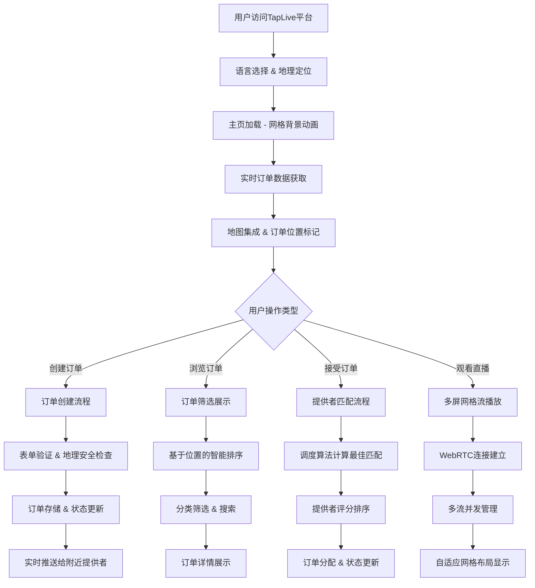

### 核心业务流程图

#### 1. 订单创建与匹配流程

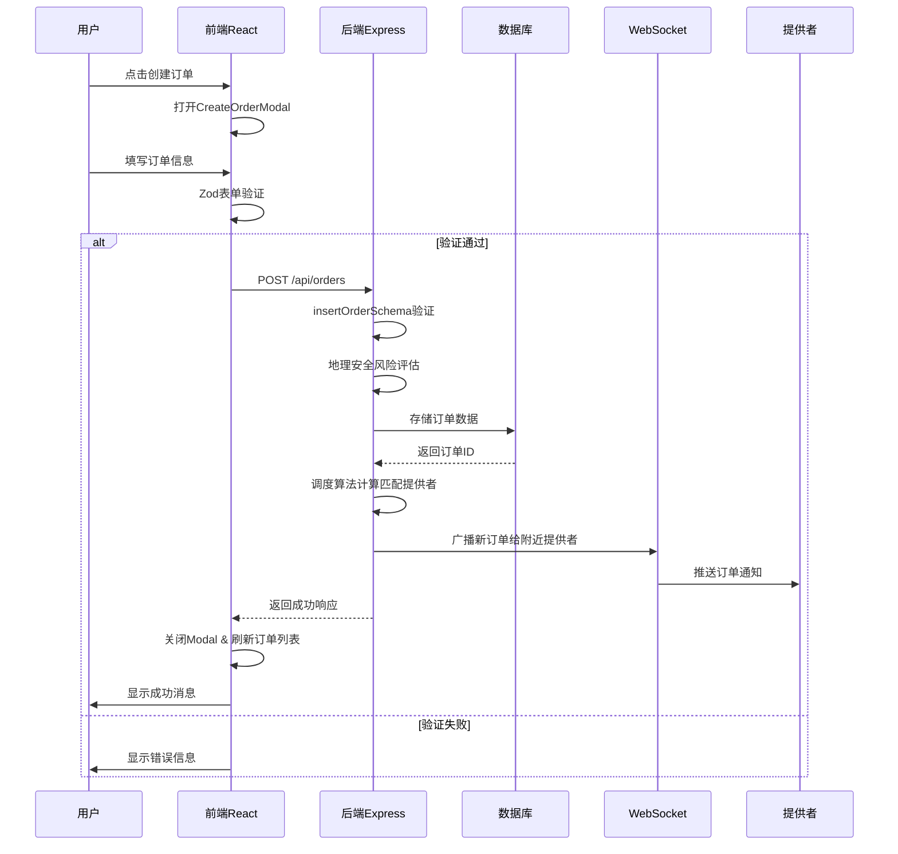

#### 2. 智能调度算法流程

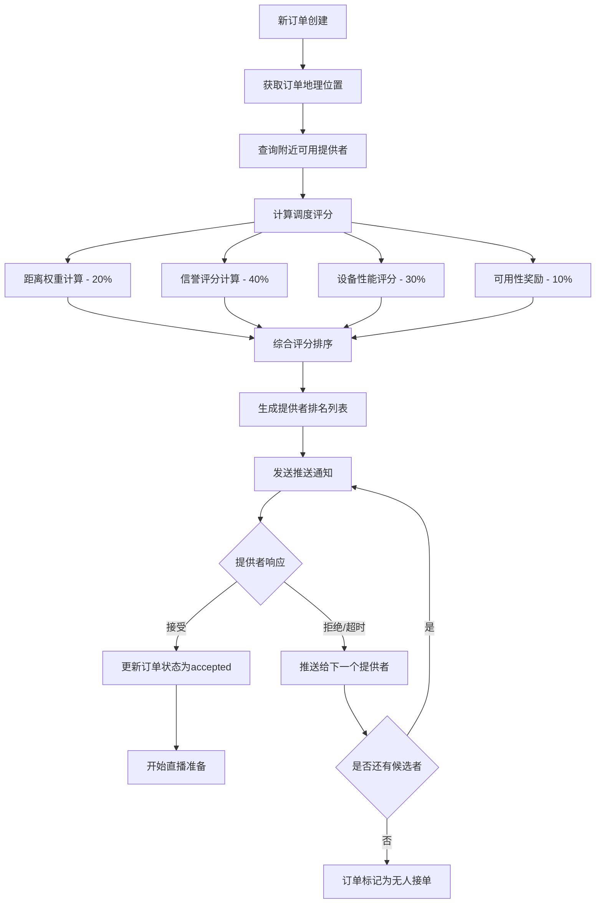

#### 3. 支付与佣金分配流程

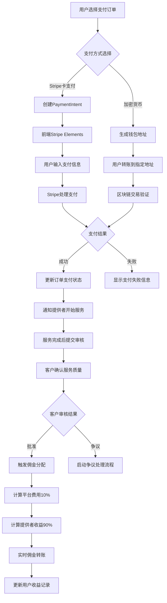

#### 4. 多屏直播网格管理流程

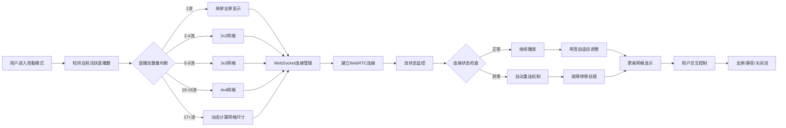

### 数据库操作流程图

#### 1. 订单状态生命周期

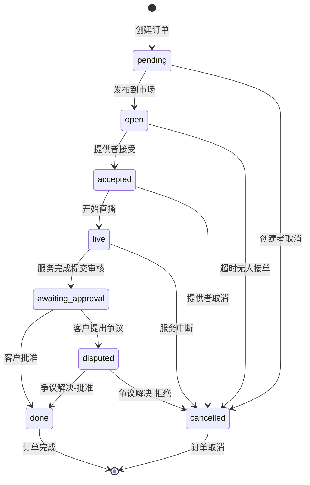

#### 2. 用户评分更新流程

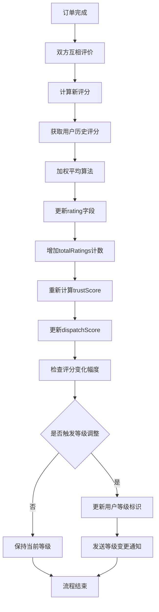

### API调用时序图

#### 1. 获取订单列表API时序

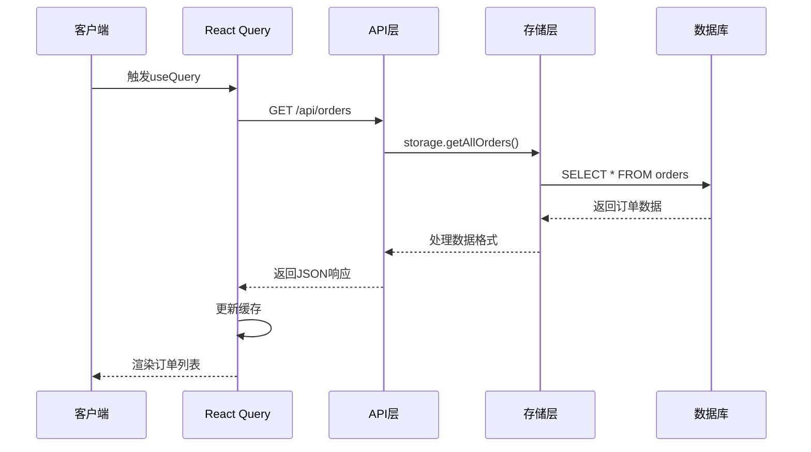

#### 2. 实时位置更新API时序

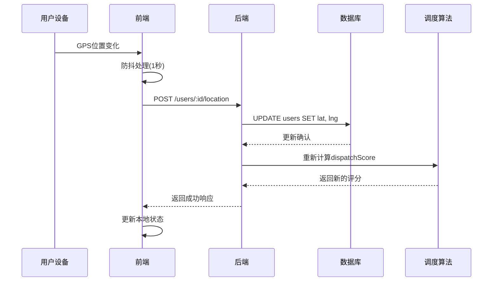

### WebSocket实时通信流程

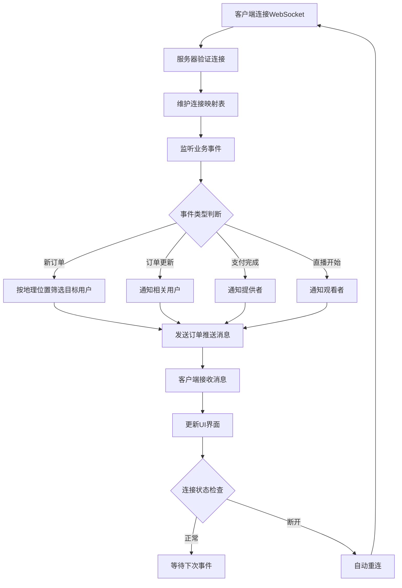

### 多语言国际化流程图

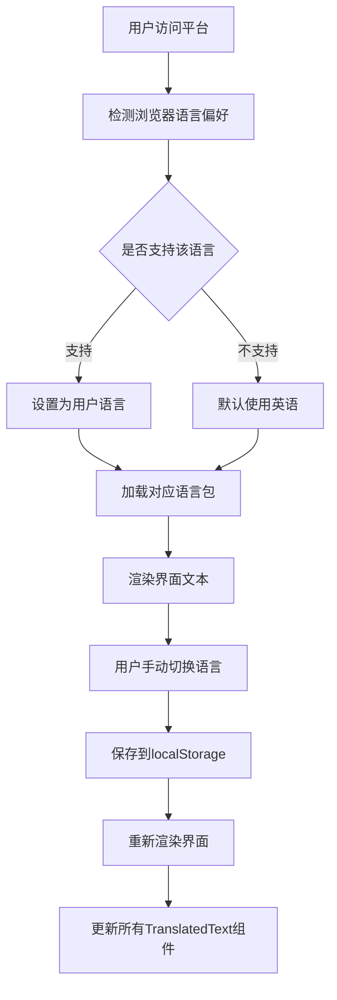

### 系统监控与日志流程

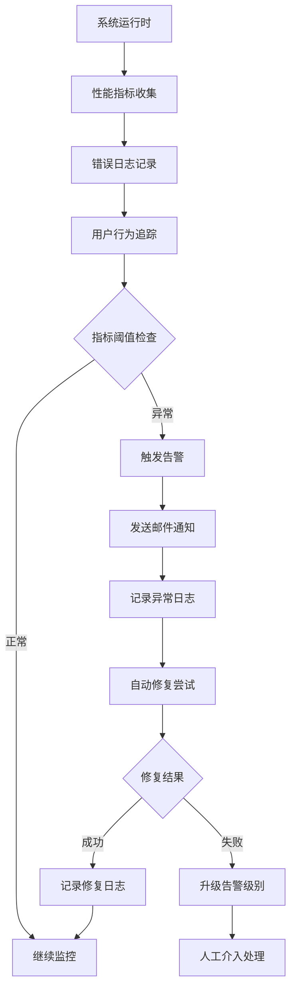

### 部署与发布流程图

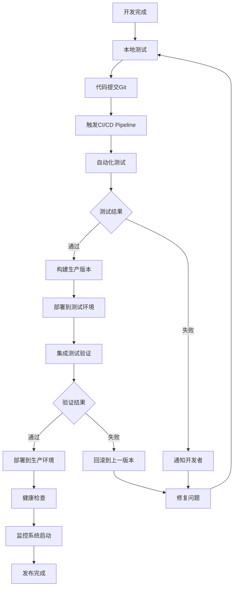

---

## 流程图说明

### 1. **总体系统架构流程图**
展示了用户从访问平台到各种操作的完整流程，包括订单创建、浏览、匹配和观看直播的主要路径。

### 2. **核心业务流程图**
详细描述了平台最重要的四个业务流程：订单创建与匹配、智能调度算法、支付与佣金分配、多屏直播网格管理。

### 3. **数据库操作流程图**
展示了订单状态的完整生命周期和用户评分更新的详细过程，确保数据一致性和业务逻辑正确性。

### 4. **API调用时序图**
描述了前后端交互的具体时序，包括数据获取和实时位置更新的完整流程。

### 5. **WebSocket实时通信流程**
展示了平台实时功能的核心实现，包括连接管理、事件分发和自动重连机制。

### 6. **系统监控与部署流程**
展示了平台的运维保障体系，包括监控告警和CI/CD自动化部署流程。

这些流程图为开发团队提供了清晰的系统架构指导，确保各个模块能够协调工作，实现平台的核心功能。